##

<!---[Scatter SI vs Rollback](/graphs/summary_scatterSIroll2020-06-28.png)--->

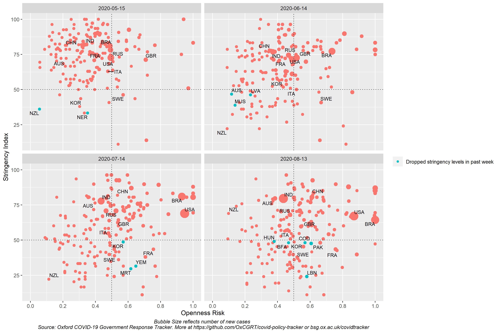

## Line plots of Stringency Index and Openness Risk

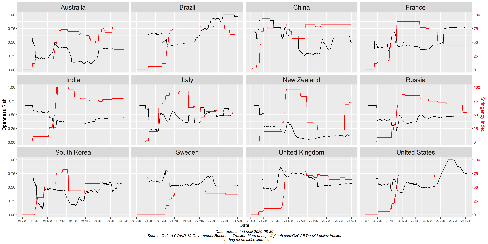

## Heatmaps of rollback scores of countries over time 
#### East Asia and Pacific 
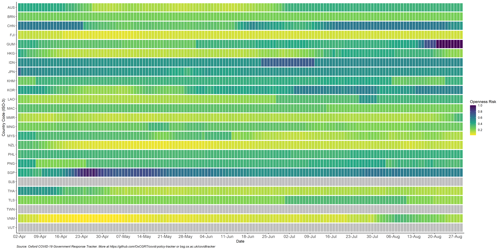

#### Europe and Central Asia
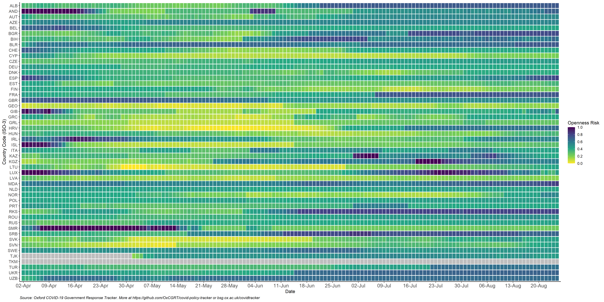

#### Latin America and Carribean
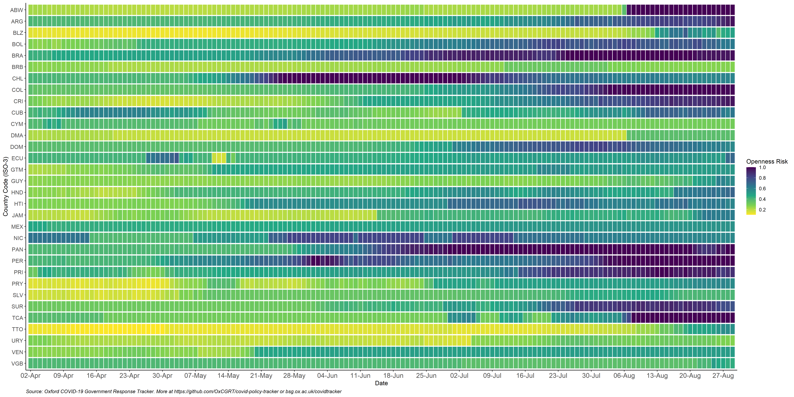

#### Middle East and North Africa
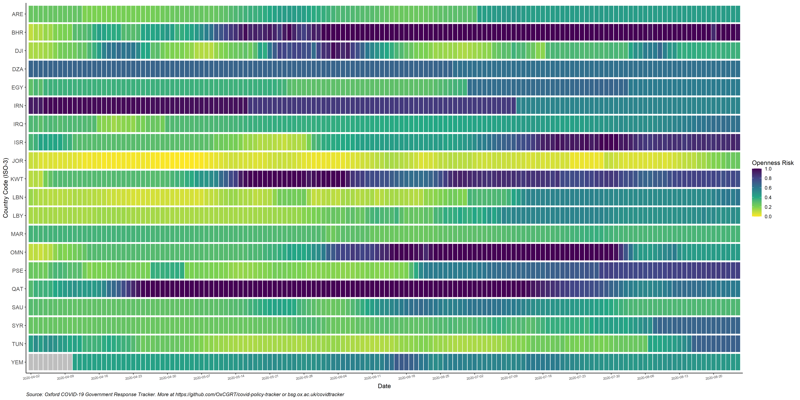

#### North America
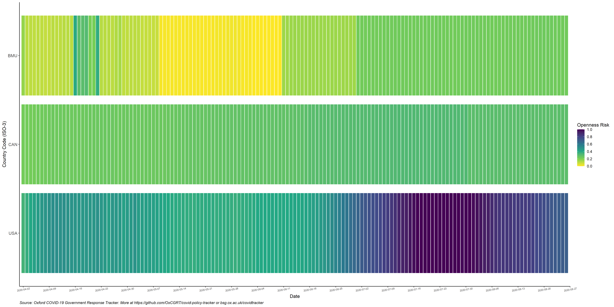

#### South Asia
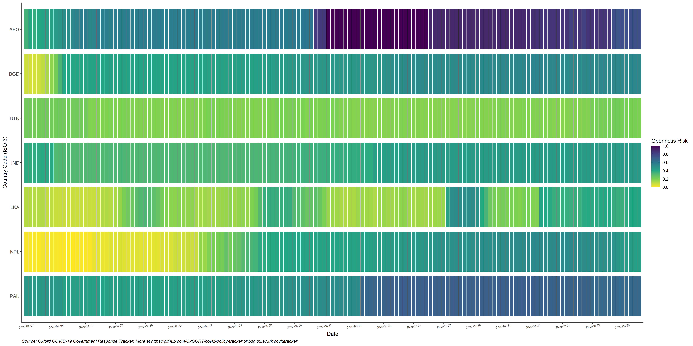

#### Sub-Saharan Africa
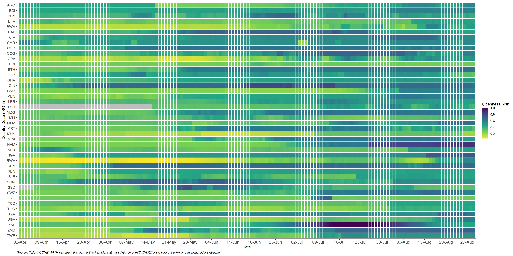

### Tile maps of rollback scores of countries (latest)

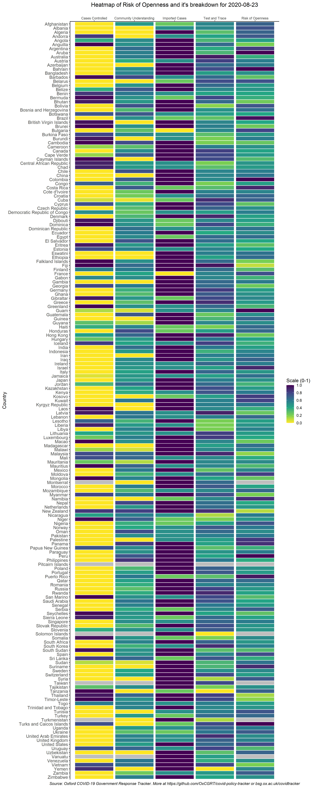

### Chloropleth maps of rollback scores of countries over time

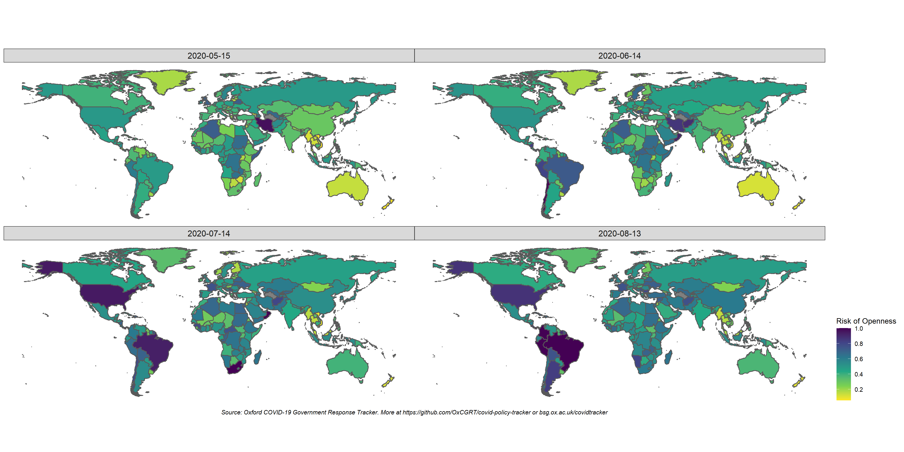

